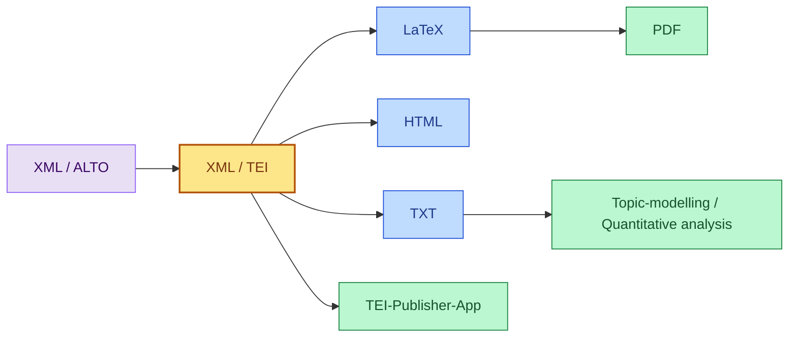
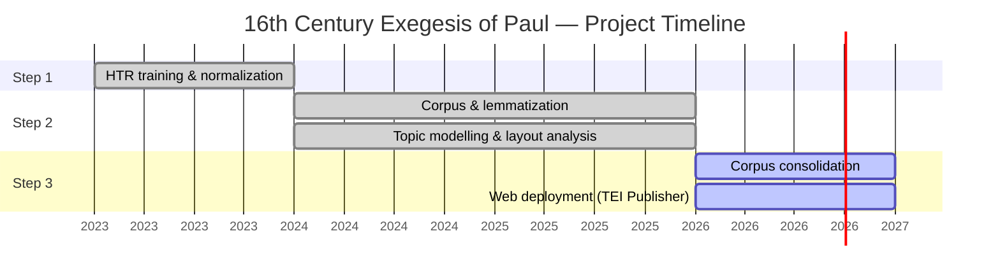

# Documentation 

- [Workflow](#workflow)
  - [I. Processing Pipeline](#i-processing-pipeline)
  - [II. Web Application: TEI Publisher](#ii-web-application-tei-publisher)
- [Guidelines](#guidelines)
  - [I. Segmentation](#i-segmentation)
  - [II. Transcription](#ii-transcription)
- [Quantitative Analysis](#quantitative-analysis)
- [Project Development (2023–2026)](#project-development-2023-2026)
  - [I. Project Summary (PDF)](#i-project-summary-pdf)
  - [II. Project Timeline](#ii-project-timeline)
  - [III. Development Phases](#iii-development-phases)

## Workflow

### I. Processing Pipeline

The complete pipeline and all scripts are described and available in the following repository:
**[Workflow Repository – PipeLineThm](https://github.com/RRP-Reading-the-Sources-DH/Documentations/tree/main/PipeLine)**

##### Further explanations and examples

> See our training materials and introductory courses:
>
> **[Training Materials – CUSO 2025 Ed-Num Online](https://github.com/CUSO-2025-Ed-Num-online?view_as=public)**
>
> **Contributors**
> - **Sonia Solfrini**, PhD candidate (University of Geneva | IHR, SNSF project [*SETAF*](https://github.com/SETAFDH))
> - **Floriane Goy**, Postdoctoral researcher (University of Geneva | IHR, SNSF project [*16th Century Exegesis of Paul*](https://github.com/RRP-Reading-the-Sources-DH))

### II. Web Application: TEI Publisher

Planned for autumn 2026.
* App-data : [Reading-the-Sources-App](https://github.com/RRP-Reading-the-Sources-DH/Reading-the-Sources-App)
---

## Guidelines

Guidelines for building the segmentation and transcription data.

### I. Segmentation
The main documentation for segmentation is here: [Annotation Guide on GitHub](https://github.com/DEFI-COLaF/LADaS/blob/main/AnnotationGuide.md).
* Examples of specific cases in our corpus: [here](https://github.com/RRP-Reading-the-Sources-DH/HTR_Paul_corpus/blob/main/README.md)

### II. Transcription
We follow, as closely as possible, the transcription standards proposed by [Catmus standard](https://catmus-guidelines.github.io):

**Citation:**
> **Ariane Pinche, Thibault Clérice, Alix Chagué, Jean-Baptiste Camps, Malamatenia Vlachou‑Efstathiou, et al.**
> *CATMuS‑Medieval: Consistent Approaches to Transcribing ManuScripts. A generalized set of guidelines and models for Latin scripts from the Middle Ages (8th–16th century).*
> 2023. HAL open archive: https://hal.archives-ouvertes.fr/hal-04346939

Examples of specific cases in our corpus are available **[here](https://github.com/RRP-Reading-the-Sources-DH/HTR_Paul_corpus/blob/main/README.md)**.

---

#### Specific Keyboards

- **[`16th-neolatin`](https://github.com/RRP-Reading-the-Sources-DH/HTR_Paul_corpus/blob/68a7f23d9eb70a8161f6066f8f650c67259446ee/keyboard/exegesis.json)**
  Custom keyboard developed specifically for our 16th-century Neo-Latin corpus.

- **[`medieval-latin`](https://github.com/RRP-Reading-the-Sources-DH/HTR_Paul_corpus/blob/68a7f23d9eb70a8161f6066f8f650c67259446ee/keyboard/medieval.json)**
  Keyboard with minor adaptations based on the one developed for the [CREMMA-Medieval-LAT](https://github.com/HTR-United/CREMMA-Medieval-LAT/) project.

> **Thibault Clérice, Malamatenia Vlachou‑Efstathiou, Alix Chagué.**
> *CREMMA Medii Aevi: Literary manuscript text recognition in Latin.*
> *Journal of Open Humanities Data*, vol. 9, p. 4, 2023.
> DOI: https://doi.org/10.5334/johd.97 · HAL open archive: https://hal.science/hal-03828353

---

## Quantitative Analysis

- content to add ...

## Project Development (2023–2026)

### I. Project Summary (PDF)

[This repository](https://github.com/RRP-Reading-the-Sources-DH/Documentations) includes the project documentation, notebooks, and scripts.

| Category | Content |
|----------|---------|
| 📄 Documents | [Project Presentation (May 2024)](https://github.com/RRP-Reading-the-Sources-DH/Documentations/blob/main/IHR_pr%C3%A9sentation_Projet.pdf) |
| 📄 Documents | [Project Working Process (April 2025)](https://github.com/RRP-Reading-the-Sources-DH/Documentations/blob/main/Projet_wk.pdf) |
| 📄 Documents | [Project Results (March 2026)](link) |
| 📰 Article | Digital Architecture — *Humanistica*: [Données et modèles pour le traitement des documents en néolatin: le cas Lambert Daneau](link) |
| 💻 Notebooks | Distant Reading · Lemmatization · LatinCy · Cleaning |
| ⚙️ Script | Data processing |

---

### II. Project Timeline

- **Step 1 (2023–2024): Lambertus Prototype** — HTR training for Roman characters and Latin abbreviations, lemmatization testing, data normalization.
- **Step 2 (2024–2026): 1 Timothy Exegesis Project** — corpus development, CLTK lemmatization, topic modelling, layout analysis model training, Corpus B.
- **Step 3 (2026): Digital Library** — corpus consolidation, expansion of Corpus C, web deployment via TEI Publisher.

---

### III. Development Phases

#### 1. HTR Lambertus Prototype (2023–2024)

**Handwritten Text Recognition for early modern Latin texts**

- HTR training for Roman characters and Latin abbreviations
- Lemmatization and linguistic annotation testing
- Data normalization

**Repositories:**
- [HTR_Lambertus_prototype](https://github.com/FourbeFlo/Lambertus)
- [OCR-testing](https://github.com/FourbeFlo/OCR_test)

---

#### 2. 1 Timothy Exegesis Project (2024–2026)

**Corpus development for the First Letter to Timothy**

- Data normalization and preprocessing
- HTML website prototype
- NLP automatic lemmatization with CLTK
- Topic modelling and visual analytics
- Layout analysis model training
- Development of **Corpus B**, completing the Timotheus Corpus

**Repositories:**
- [HTR_1-Timotheus](https://github.com/RRP-Reading-the-Sources-DH/HTR_1-Timotheus)
- [Pipeline Timotheus](https://github.com/RRP-Reading-the-Sources-DH/PipeLineThm)
- [Website: Reforming Paul](https://github.com/RRP-Reading-the-Sources-DH/ReformingPaul)
- [Layout Analysis dataset](https://github.com/RRP-Reading-the-Sources-DH/Segmentation_model)

---

#### 3. Digital Library (2026)

**Corpus consolidation and web deployment**

- Migration of HTR Lambertus prototype data → **Corpus A**
- Migration of 1 Timothy project data → **Corpus B**
- Expansion of **Corpus C** with additional books
- Web application deployment via **TEI Publisher**

**Repositories:**
- [HTR-Corpus-A](https://github.com/RRP-Reading-the-Sources-DH/HTR-Corpus-A)
- [TEI-16th-Exegesis](https://github.com/RRP-Reading-the-Sources-DH/TEI-16th-Exegesis)
- HTR-Corpus-C: ...
- Topic Modelling Results: ...
- Paulus-App: ...

---